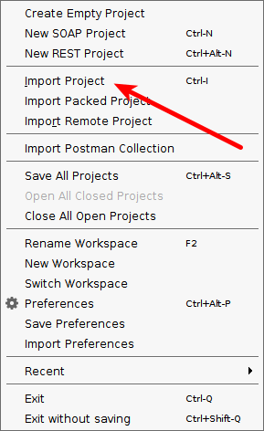
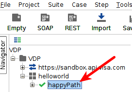
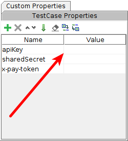

# Getting started on Visa Developer
### API key - Shared Secret (X-Pay-Token)

Some Visa APIs require API Key – Shared Secret authentication, which Visa refers to as `x-pay-token`. To invoke an API using `x-pay-token`, you will need an API Key and a Shared Secret, which is provided on the application details page as mentioned in the Visa Developer Portal introduction.

To successfully invoke Visa APIs using `x-pay-token`, your application needs to do the following:

1. Include the API Key as a query parameter
2. Include the `Accept` and `x-pay-token` in the request header as shown in the sample below.

|Field   |Value   |
|:-------|:-------|
|Accept  |Application/json|
|x-pay-token|x-pay-token*|

**\*Note:** Refer to the section below on hwo to generate the `x-pay-token` value with SHA256 HMAC.

##### Sample Header #####
```
GET /vdp/helloworld?apikey=KSKDFJOP934ALSFDJP34 HTTP/1.0 
 Host: sandbox.api.visa.com
 Accept: application/json
 X-PAY-TOKEN: xv2:1455716783:f5d15ed23f825ac69cd42e6fa187a175ecf7e9566ce4f21e11bad49bed4cc363
 ```


**<a name="xpaygen"></a>Generating the x-pay-token**

1. Build a string of concatenated values with the following parameters:

|Parameter     |Description     |
|:-------------|:---------------|
|timestamp     |Current *UTC* timestamp|
|resource_path |The API endpoint    |
|query_string  |The apiKey is a required query parameter.  Query parameters should be in lexicographical order.|
|request_body  |The API endpoint-specific request body string.|

**<a name="mssg"></a>Example:**
```
message = timestamp + resource_path + query_string + request_body;
```
2. Construct the `x-pay-token` as shown below:

**<a name="xp"></a>Example:**
```
xpaytoken = "xv2:" + ":" + SHA256HMAC(shared_secret,message);
```
### <a name="hwphp"></a>Testing x-pay-token with `helloworld` ###
1. Edit the file [`helloworld.php`](helloworld.php) in your editor of choice
2. Take note of your Visa Developer API Key and Shared Secret
3. In your text editor set the values for `$apikey` and `$secret` with your API Key and Shared Secret

**Example**
```PHP
$apikey='KSKDFJOP934ALSFDJP34';
$secret='LKJQW90P4439398Y279O';
```

4. Save your changes and upload or view locally
If the calculation of the `x-pay-token` is correct you will see a timestamp and the message `helloworld`

**Example**
```json
{
    "timestamp": "2018-02-28T00:48:31",
    "message": "helloworld"
}
```

### <a name="sui"></a>Testing x-pay-token with SoapUI ###
1. Download [**SoapUI 5.4**](https://www.soapui.org/downloads/soapui/soapui-os-older-versions.html)
> SoapUI 5.2 is acceptable
2. Save `VDP-soapui-project.xml` to your preferred project directory
3. Open SoapUI and import `VDP-soapui-project.xml` by selecting **File>Import Project**

4. Expand the VDP project and click the `happyPath` Test Case



5. Input your `apiKey` and `sharedSecret` (leave `x-pay-token` **blank**)



6. Double-click the Test Suite named `helloworld` and click the green **play** icon

To get set up, navigate to:
https://developer.visa.com/vdpguide#x_pay_token
